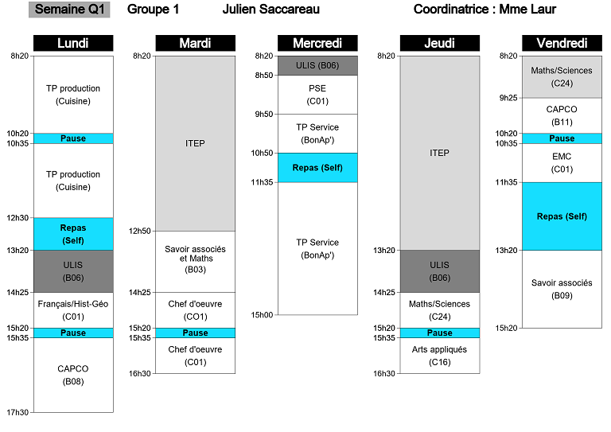

# Easy timetable

*Simple and readable timetable, compliant for struggling pupils.*

Format: 

## Functionalities
* From Monday to Friday
* Colors
* Sans serif font
* Class hour easily readable

## Installation
1. Dowload and install python : https://www.python.org/downloads/

## How to
1. Duplicate **edt_modele_renee_bonnet.py** and rename the file with name of your choice (pupil name for example). This file contains datas of the generated timetable. 

2. Open this file with text editor, you have to edit the code between :
3. `##########  DEBUT MODIFICATION  #######################`
                     and 
`############  FIN MODIFICATION  #######################`

3. Associate the file (must be done only once):
Right-click the file and click Properties. In the file Properties, click the Change button next to the "Opens with" option. 
Select the program : C:\Users\`Your pc username`\AppData\Local\Programs\Python\`PythonVersion-Version`.

4. Generate the timetable picture by double clicking on the file. Timetable picture is in same directory.

## Adding colors
1. Edit **couleurs.py**
2. Add a line and set RVB color `RED` `GREEN` `BLUE`: `new_color=(RED,GREEN,BLUE)`
3. Use the code `couleurs.new_color` in the file created from **How to/1**
